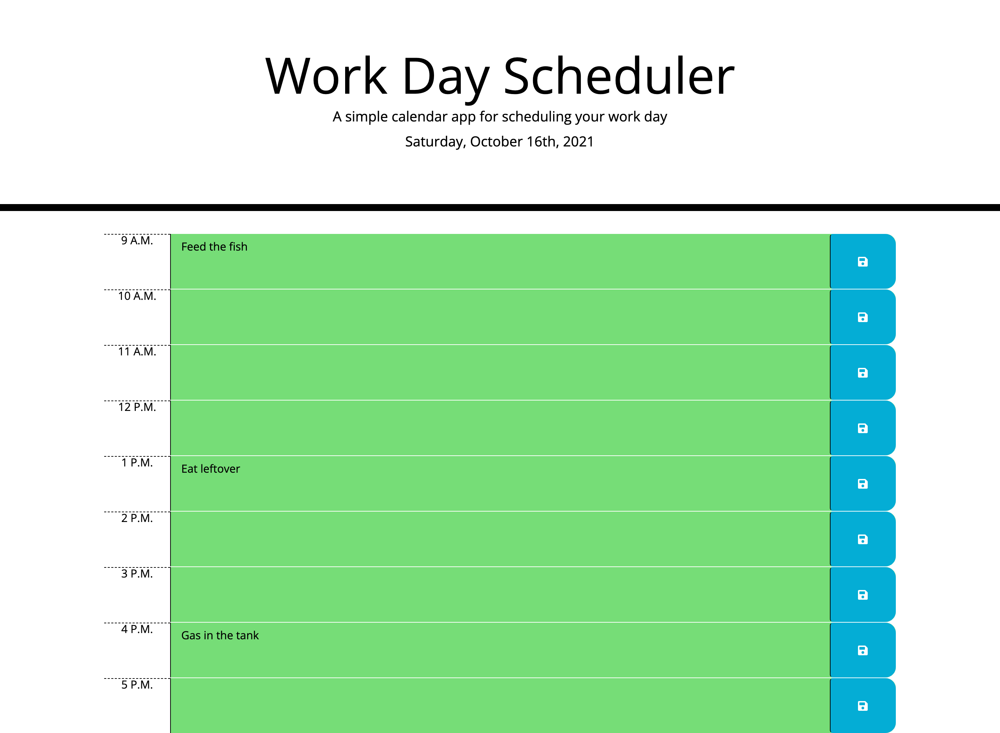

# Work Day Scheduler 

Description of word day scheduler.

https://hpere102.github.io/work-day-scheduler/

## About this website

This website presents the user with timeblocks from 9AM to 5pm for the user to input hourly tasks with the ability to save each task with a save button to the right. Every task will be saved in the local storage. If a task is behind the current time, the time block will be grey, if the time block is in the current hour, the time block will be red, and if the time block is in ahead of the current hour the time block will be green.

### Built with

* HTML
* CSS
* Javascript
* JQuery
* Bootstrap
